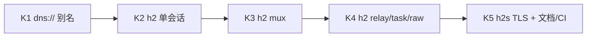

# Phase K：HTTP/2 多路复用隧道与 DNS 查询隧道

本文档为 **Phase K** 实施规划，目标交付：

1. **`h2://`** — 基于 HTTP/2 的多路复用传输隧道（含 mux / relay / task）
2. **`dns://`** — rem 风格常规 DNS 查询隧道（与现有 `simplex+dns://` 同栈）

原则：以现有 TCP/WS/Simplex 接入模式为模板，优先复用 `encode_transport_frame`、mux 路由层与 runtime 分支，避免另起一套协议。

相关现状：[`http-transport.md`](http-transport.md)、[`simplex-transport.md`](simplex-transport.md)、[`development-plan.md`](development-plan.md)

---

## 1. 现状与差距

| URL | 当前状态 | mux | relay | 说明 |
|-----|----------|-----|-------|------|
| `http://` | ✅ | ✅ | ✅ | 与 `simplex+http://` 同栈，HTTP/1.1 长轮询 |
| `streamhttp://` | ✅ | ❌ | ❌ | SSE 下行 + POST 上行，单会话 |
| `simplex+dns://` | ✅ | ✅ | ✅ | UDP DNS 报文 + SR-ARQ 分片 |
| **`dns://`** | ✅ | ✅ | ✅ | K1：`simplex+dns://` 别名 |
| **`h2://`** | ✅ | ✅ | ✅ | `h2_mux` + relay 回归 |

**为何需要 `h2://`（而非继续扩展 `http://`）**

- `http://` 每方向独立请求，靠轮询模拟全双工，延迟与连接开销高
- `streamhttp://` 无 mux/relay，不适合组网
- HTTP/2 单连接多 stream，可消除 HOL blocking，适合 CDN/反向代理后的 **长连接 + 多路复用**

**为何需要 `dns://`（而非只保留 `simplex+dns://`）**

- 与 G1 中 `http://` / `simplex+http://` 对齐：对外配置用 rem 常规 scheme，对内仍走 Simplex DNS 栈
- 实现成本低（scheme 路由），统一文档与 `fusion.toml` 示例

---

## 2. 阶段划分



| 阶段 | 范围 | 预估 | 优先级 |
|------|------|------|--------|
| **K1** | `dns://` scheme 接入 | 3–5 天 | P0 |
| **K2** | `h2://` direct session（hello/task） | 1–2 周 | P0 |
| **K3** | `h2_mux` 多路复用 | 1–2 周 | P0 |
| **K4** | relay / raw / 3–5 跳回归 | 1 周 | P0 |
| **K5** | `h2s://`、TLS 参数、10-hop 可选 | 3–5 天 | P1 |
| **K6**（可选） | 公网 DNS 穿透增强 | 按需 | P2 |

建议 **先 K1 再 K2–K4**；K1 可独立合并，不阻塞 h2 开发。

---

## 3. K1：`dns://` 常规 DNS 隧道

### 3.1 目标

```bash
# 与 simplex+dns 等价
cargo run --bin fusion -- -s dns://0.0.0.0:5353/task.local -a dns-server
cargo run --bin fusion -- -c dns://127.0.0.1:5353/task.local --task-peer <ID> task shell "whoami"
```

能力矩阵与 `simplex+dns://` **完全一致**（task / mux / raw / relay）。

### 3.2 设计

新增 scheme 助手（仿 [`src/tunnel/http_poll.rs`](../src/tunnel/http_poll.rs)）：

```rust
// src/tunnel/dns_tunnel.rs（或并入 http_poll 改名为 tunnel_scheme.rs）
pub fn is_dns_tunnel_scheme(scheme: &str) -> bool {
    matches!(scheme, "dns" | "simplex+dns")
}
```

**不复制** `simplex_dns.rs` 逻辑；仅在分类/路由层将 `dns` 映射到现有 `ListenerTransport::SimplexDns` 与 `DialTarget::SimplexDns`。

### 3.3 改动清单

| 文件 | 改动 |
|------|------|
| `src/tunnel/dns_tunnel.rs` | `is_dns_tunnel_scheme()` |
| `src/tunnel/mod.rs` | `pub mod dns_tunnel` |
| `src/tunnel/dialer.rs` | `dns` → `DialTarget::SimplexDns` |
| `src/tunnel/listener.rs` | `dns` bind；`display_url` 为 `dns://...` |
| `src/app/runtime_mode.rs` | outbound/inbound 识别 `dns` |
| `src/app/runtime_task.rs` | task 分支 `dns` |
| `src/app/runtime_orchestrator.rs` | 入站监听（若尚未统一走 listener） |
| `src/app/runtime_relay.rs` | relay 分支（与 simplex+dns 同路径） |
| `crates/fusion-logic/src/url.rs` | 允许 `dns` scheme 解析 |
| `fusion.toml.example` | `dns://` 示例 |
| `docs/simplex-transport.md` | 增加 `dns://` 别名说明 |
| `docs/test-matrix.md` | 新增回归项 |

### 3.4 测试

```bash
cargo test --lib parse_dns_tunnel_url          # config/url
cargo test --lib classify_dns_endpoint         # dialer
cargo test --lib outbound_task_over_dns_endpoint_succeeds  # runtime_tests（新）
cargo test --lib dns_relay_stream_bridge_three_hops        # 可选，复用 simplex_dns 拓扑改 URL
```

### 3.5 验收

- [x] `-s dns://` / `-c dns://` 与 `simplex+dns://` 行为一致
- [x] `cargo test --lib` 全绿
- [x] baseline / quick-start 同步

---

## 4. K2–K5：`h2://` HTTP/2 多路复用隧道

### 4.1 目标

单条 HTTP/2 连接上：

- **控制面**：Hello / Heartbeat / RouteUpdate / StreamOpen / StreamClose（reserved h2 stream）
- **数据面**：每个 Fusion `stream_id` 对应 **独立 h2 stream**，承载 `StreamData` 分片（长度前缀 + transport frame bytes）

与 TCP mux 能力对齐：

| 能力 | K2 | K3 | K4 | K5 |
|------|----|----|----|----|
| direct session | ✅ | | | |
| direct task | ✅ | | | |
| mux 多 stream | | ✅ | | |
| raw service | | | ✅ | |
| relay 3/5 hop | | | ✅ | |
| `h2s://` + TLS query | | | | ✅ |
| 10-hop 压测 | | | | 可选 |

### 4.2 协议映射

```
HTTP/2 Connection
├── stream 1 (固定): 控制帧双向
│     └── length-prefixed Fusion Frame (JSON transport)
├── stream 3,5,7,... (client-initiated): Fusion stream_id 奇数映射
└── stream 2,4,6,... (server-initiated): Fusion stream_id 偶数映射
```

**stream_id 映射规则（建议）**

- Fusion 分配 `stream_id`（现有 `session::stream` allocator）
- 打开 stream 时发送 `StreamOpen`（控制 stream）
- 数据走 **新 h2 stream**：`h2_stream_id = fusion_stream_id * 2 + (client_side ? 1 : 0)` 或维护显式 HashMap
- h2 stream 关闭 ↔ `StreamClose`

**备选（简化 MVP）**

若 K3 工期紧，K2 可先在 **单 h2 stream** 上跑 length-prefixed 帧（等同 TCP mux），K3 再拆多 h2 stream。文档中应标明 MVP 与最终形态。

**推荐**：直接做 **每 Fusion stream 一条 h2 stream**，否则与「HTTP/2 多路复用」产品语义不符。

### 4.3 模块结构

```
src/tunnel/
  h2.rs           # 连接建立、SETTINGS、ping/heartbeat、TLS ALPN
  h2_mux.rs       # MuxH2Peer：stream 路由、send_frame、open_stream_receiver
  h2_listener.rs  # 可选：从 h2.rs 拆出 accept 循环
```

参考模板：

- 连接/握手：[`src/tunnel/tcp_mux.rs`](../src/tunnel/tcp_mux.rs)
- mux 路由：[`src/tunnel/ws_mux.rs`](../src/tunnel/ws_mux.rs)
- TLS：[`src/tunnel/tls.rs`](../src/tunnel/tls.rs)（`build_optional_tls_connector` / acceptor）

### 4.4 依赖

在 [`Cargo.toml`](../Cargo.toml) 增加：

```toml
h2 = "0.4"
bytes = "1"
http = "1"
```

客户端/服务端均基于 `tokio::net::TcpStream` + `h2::client::handshake` / `h2::server::handshake`。

**ALPN**：cleartext `h2c`（prior knowledge 或 Upgrade）与 TLS `h2`（`h2s://`）。

### 4.5 URL 形态

```text
h2://HOST:PORT/PATH           # cleartext h2c（实验/内网）
h2s://HOST:PORT/PATH          # TLS + ALPN h2（生产）
```

Query 复用现有 TLS 参数（与 `wss://` 一致）：

- `tls-cert` / `tls-key` / `tls-client-ca`（服务端 mTLS）
- `tls-ca` / `tls-client-cert` / `tls-client-key` / `tls-insecure=1`（客户端）

PATH 默认 `/tunnel`；与 `ws://host/tunnel` 语义相同，仅 ALPN 与 framing 不同。

### 4.6 Runtime 接入

| 层 | 模式 enum（新增） | 说明 |
|----|-------------------|------|
| `ListenerTransport` | `H2` | `listener.rs` bind TCP + h2 server |
| `DialTarget` | `H2 { url }` | `dialer.rs` |
| `InboundRuntimeMode` | `TaskH2` / `RawH2` / `DirectH2` | `runtime_mode.rs` |
| `OutboundRuntimeMode` | `TaskH2` / `RelayH2` / … | 与 TCP/WS 对齐 |

需改文件（与 K1 类似 +）：

- `src/app/runtime_orchestrator.rs` — 入站 accept 循环
- `src/app/runtime_relay.rs` — `send_direct_announce_h2_mux`
- `src/app/runtime_peer.rs` / `runtime_service.rs` — raw/socks 出站
- `src/app/upstream_pool.rs` — 可选：h2 连接池复用（P1）

### 4.7 分阶段任务

#### K2 — Direct session + task

- [x] `h2_mux.rs`：client/server handshake、连接生命周期
- [x] 单 h2 控制 stream：`read_frame` / `send_frame`
- [x] Hello / Heartbeat / TaskRequest 单跳 roundtrip
- [x] 测试：`h2_session_hello_heartbeat_roundtrip`、`outbound_task_over_h2_endpoint_succeeds`

#### K3 — Mux

- [x] `h2_mux.rs`：`MuxH2Peer`，stream 路由表 + pending 缓冲
- [x] 控制/数据面拆分：client 侧 `StreamData` 独立 h2 stream；server outbound + relay 回程走 control
- [x] 测试：`h2_mux_routes_frames_by_stream_id`、`h2_mux_buffers_until_receiver_opened`、`h2_mux_uses_separate_data_streams_for_concurrent_ids`、`h2_server_to_client_stream_data_delivery`

#### K4 — Raw + Relay

- [x] 入站 `-r raw://` over h2 mux
- [x] `runtime_tests`：单跳 / 3 hop / 5 hop / 10 hop relay stream bridge
- [ ] socks5/http over relay（可选，非 K4 阻塞）

#### K5 — TLS 与交付

- [x] `h2s://` scheme + TLS query（ALPN `h2`）
- [x] mTLS 测试（`h2s_handshake_with_mutual_tls`）
- [x] 文档 [`docs/h2-transport.md`](h2-transport.md)
- [x] `fusion.toml.example`、`test-matrix.md`、`baseline-current-capabilities.md`

### 4.8 非目标（Phase K 不做）

- HTTP/2 Extended CONNECT（WebSocket 隧道）
- HTTP/3 / QUIC
- 经 CDN 的 h2 多跳透明代理（需额外 CONNECT 语义）
- 替换现有 `http://` / `streamhttp://`

### 4.9 风险与缓解

| 风险 | 缓解 |
|------|------|
| h2 流控导致背压死锁 | 读循环与 mpsc 解耦；监控 WINDOW_UPDATE |
| 中间盒仅允许 h2 to 443 | 文档推荐 `h2s://host:443/path` |
| 与 streamhttp 混淆 | 独立 scheme + 文档对比表 |
| 实现周期过长 | K2 末评估；必要时 K2 先用单 stream MVP |

---

## 5. K6（可选）：DNS 公网穿透增强

当前 `simplex+dns` / 计划中的 `dns://` 为 **直连 UDP DNS 端口**（如 5353），不是经公网递归解析器的隐蔽隧道。

若后续需要 rem 级「经 8.8.8.8 查询子域携带数据」：

| 项 | 说明 |
|----|------|
| 编码 | 子域标签 Base32 分片（已有 `chunk_query_payload` 基础） |
| 上行 | TXT/CNAME 查询经指定 resolver |
| 下行 | authoritative 模拟或 DNS server 侧轮询 |
| EDNS0 | 扩大 UDP payload |
| DoH | `dns+https://` 作为独立 scheme 立项 |

**建议**：K6 单独立项，不与 K1 混淆；K1 仅 scheme 别名。

---

## 6. 与现有传输对比（交付后）

| | 连接模型 | 多路复用 | 典型延迟 | CDN 友好 |
|--|----------|----------|----------|----------|
| `tcp://` | 长连接 | Fusion mux 单连接 | 低 | 差 |
| `ws://` | 长连接 | Fusion mux | 低 | 中 |
| `http://` | 短请求轮询 | Fusion mux | 高 | 高 |
| `streamhttp://` | SSE + POST | 无 | 中 | 高 |
| **`h2://`** | **长连接 h2** | **h2 stream + Fusion mux** | **低–中** | **高** |
| **`dns://`** | **UDP 查询** | **Fusion mux + SR-ARQ** | **高** | **低（受限网）** |

---

## 7. 测试矩阵（计划新增）

| 场景 | 测试名（建议） |
|------|----------------|
| dns URL 解析 | `config::tests::parse_dns_tunnel_url` |
| dns task | `runtime_tests::outbound_task_over_dns_endpoint_succeeds` |
| dns relay 3-hop | `runtime_tests::dns_relay_stream_bridge_roundtrip_through_three_hops` |
| h2 hello | `tunnel::h2_mux::tests::h2_session_hello_heartbeat_roundtrip` |
| h2 task | `runtime_tests::outbound_task_over_h2_endpoint_succeeds` |
| h2 mux | `tunnel::h2_mux::tests::h2_mux_routes_frames_by_stream_id` |
| h2 relay 单跳 | `runtime_tests::h2_relay_stream_bridge_roundtrip` |
| h2 relay 3-hop | `runtime_tests::h2_relay_stream_bridge_roundtrip_through_three_hops` |
| h2 relay 5-hop | `runtime_tests::h2_relay_stream_bridge_roundtrip_through_five_hops` |
| h2 relay 10-hop | `runtime_tests::h2_relay_stream_bridge_roundtrip_through_ten_hops` |
| h2s mTLS | `tunnel::h2_mux::tests::h2s_handshake_with_mutual_tls` |

---

## 8. 文档与配置同步清单

每项阶段合并前：

- [x] `cargo test --lib`
- [x] [`docs/baseline-current-capabilities.md`](baseline-current-capabilities.md)
- [x] [`docs/test-matrix.md`](test-matrix.md)
- [x] [`docs/quick-start.md`](quick-start.md)
- [x] [`fusion.toml.example`](../fusion.toml.example)
- [x] [`docs/development-plan.md`](development-plan.md) Phase K 状态
- [x] README 传输列表

---

## 9. 推荐实施顺序

1. **Week 1**：K1 全流程（dns:// 别名 + 测试 + 文档）
2. **Week 2–3**：K2 h2 连接 + direct task
3. **Week 4–5**：K3 h2_mux
4. **Week 6**：K4 relay/raw + 3/5 hop
5. **Week 7**：K5 h2s/TLS + 文档收口

K1 可与 K2 并行（不同开发者）或作为 K2 前的快速胜利。

---

## 10. 里程碑

| 里程碑 | 标志 |
|--------|------|
| **M-K1** | `dns://` 与 `simplex+dns://` 等价可演示 |
| **M-K2** | `h2://` 单跳 task 可演示 |
| **M-K3** | `h2://` mux + raw 可演示 |
| **M-K4** | `h2://` 5-hop relay 回归通过 |
| **M-K5** | `h2s://` + 文档/CI 完整 |
